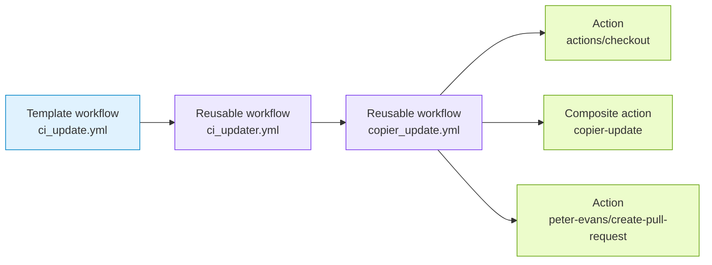

# CI Update

`ci_update.yml` keeps a consumer repository aligned with this CI template.

## Generated When

Always generated.

## Runs On

- Daily schedule at `0 15 * * *`
- Manual `workflow_dispatch`

## Calls

```yaml
uses: athackst/ci/.github/workflows/ci_updater.yml@main
```

See [`ci_updater.yml`](../workflows/ci_updater.md) for the reusable workflow
contract.

## Dependencies



## Permissions

- `contents: write` to commit template updates.
- `pull-requests: write` to open or update the template-sync PR.
- `actions: write` so updater PRs can modify `.github/workflows/*`.

## Behavior

- Runs `copier update` through the reusable CI Updater workflow.
- Opens or updates a PR from `ci/update-ci-template`.
- Labels updater PRs automatically for automerge and changelog skipping.
- Uses `secrets.CI_BOT_TOKEN` as the reusable workflow `token` secret.
