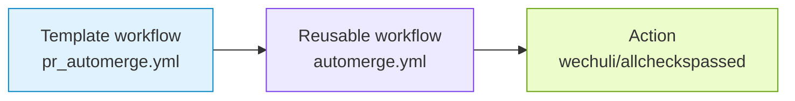

# PR Automerge

`pr_automerge.yml` handles pull requests labeled `automerge`.

## Generated When

Always generated.

## Runs On

- `pull_request_target` when labels are added or removed

## Calls

```yaml
uses: athackst/ci/.github/workflows/automerge.yml@main
```

See [`automerge.yml`](../workflows/automerge.md) for the reusable workflow
contract.

## Dependencies



## Permissions

- `contents: write`
- `pull-requests: write`
- `checks: read`

## Behavior

- Only acts on open pull requests.
- Passes the Copier `automerge_mode` answer to the reusable Automerge workflow.
- Uses per-PR concurrency without canceling in-progress runs, so polling jobs can continue waiting for checks.
- Uses `secrets.CI_BOT_TOKEN` as the reusable workflow `token` secret.
- The reusable workflow never checks out or runs pull request code.
