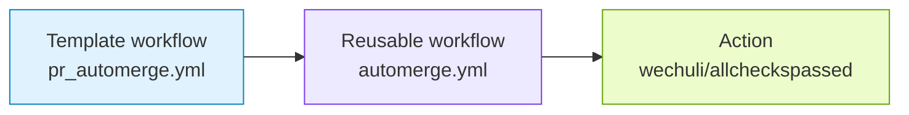

# PR Automerge

`pr_automerge.yml` handles pull requests labeled `automerge`.

## Generated When

Always generated.

## Runs On

- `pull_request_target` when labels are added or removed

## Calls

```yaml
uses: athackst/ci/.github/workflows/automerge.yml@main
```

See [`automerge.yml`](../workflows/automerge.md) for the reusable workflow
contract.

## Dependencies


```mermaid
flowchart LR
    template["Template workflow<br/>pr_automerge.yml"] --> automerge["Reusable workflow<br/>automerge.yml"]
    automerge --> checks["Action<br/>wechuli/allcheckspassed"]

    classDef template fill:#e0f2fe,stroke:#0284c7
    classDef workflow fill:#ede9fe,stroke:#7c3aed
    classDef action fill:#ecfccb,stroke:#65a30d
    class template template
    class automerge workflow
    class checks action
```

## Permissions

- `contents: write`
- `pull-requests: write`
- `checks: read`

## Behavior

- Subscribes to `labeled`, `unlabeled`, and `ready_for_review` pull request
  activity. Each event can reconcile the live PR state; closed PRs are
  ignored.
- Reconciles an existing `automerge` label when a draft PR becomes ready for
  review.
- Passes the Copier `automerge_mode` answer to the reusable Automerge workflow.
- Refuses to enable or perform automerge for pull requests whose head branch is
  hosted in a fork.
- Removes the `automerge` label from fork PRs while leaving manually configured
  native auto-merge state unchanged.
- In `poll` mode, confirms the `automerge` label is still present after checks
  pass and immediately before merging.
- Reports whether auto-merge was enabled or disabled, the PR was merged, or no
  automerge change was made.
- Uses per-PR concurrency and lets the latest label or review event reconcile
  the live PR state. A newer event cancels an older run, including polling.
- Uses `secrets.CI_BOT_TOKEN` as the reusable workflow `token` secret.
- The reusable workflow never checks out or runs pull request code.
