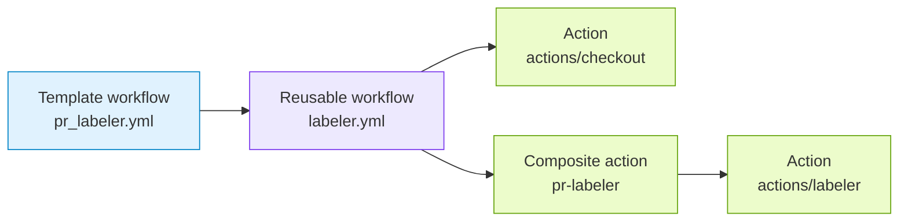

# PR Labeler

`pr_labeler.yml` applies pull request labels from `.github/ci-config.yml`.

## Generated When

Always generated.

## Runs On

- `pull_request_target`

## Calls

```yaml
uses: athackst/ci/.github/workflows/labeler.yml@main
```

See [`labeler.yml`](../workflows/labeler.md) for the reusable workflow
contract.

## Dependencies



## Permissions

- `contents: read` to check out `.github/ci-config.yml`.
- `pull-requests: write` to apply PR labels.

## Behavior

- Uses the shared CI config as the labeler source.
- Routes secret-requiring label writes through `pull_request_target`.
- Uses `secrets.CI_BOT_TOKEN` as the reusable workflow `token` secret.
- The reusable workflow checks out the repository configuration and delegates matching to the
  [`pr-labeler`](../actions/pr-labeler/README.md) composite action.
