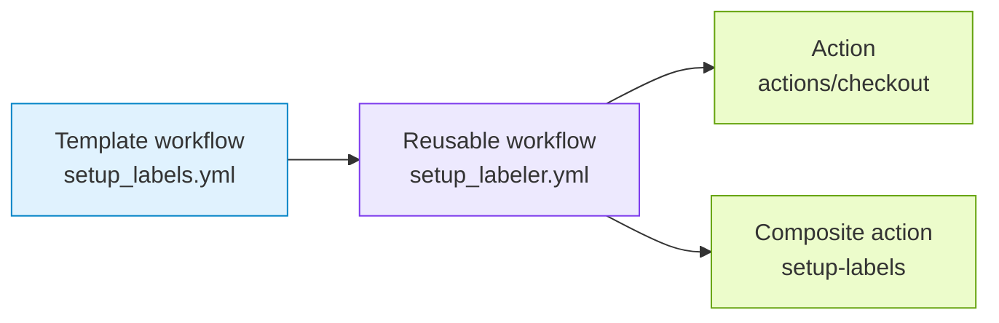

# Setup Labels

`setup_labels.yml` creates or updates repository label metadata from
`.github/ci-config.yml`.

## Generated When

Always generated.

## Runs On

- Pushes to `main` that change `.github/ci-config.yml`
- Manual `workflow_dispatch`

## Calls

```yaml
uses: athackst/ci/.github/workflows/setup_labeler.yml@main
```

See [`setup_labeler.yml`](../workflows/setup_labeler.md) for the reusable
workflow contract.

## Dependencies



## Permissions

- `contents: read` to check out `.github/ci-config.yml`.
- `issues: write` to create and update repository labels.

## Behavior

- Uses `secrets.CI_BOT_TOKEN` as the reusable workflow `token` secret.
- Reads `.github/ci-config.yml`.
- Creates, updates, skips, or leaves labels unchanged based on label metadata
  through the [`setup-labels`](../actions/setup-labels/README.md) composite
  action.
