# Site

`site.yml` builds and optionally deploys documentation sites.

## Generated When

Generated when `site_generator` is `mkdocs` or `jekyll`.

Choose `site_generator: none` when an external provider owns the site workflow.

## Runs On

- Pushes to `main`
- Pull requests
- Release `published` events

## Calls

For MkDocs:

```yaml
uses: athackst/ci/.github/workflows/mkdocs_site.yml@main
```

See [`mkdocs_site.yml`](../workflows/mkdocs_site.md) for the reusable workflow
contract.

For Jekyll:

```yaml
uses: athackst/ci/.github/workflows/jekyll_site.yml@main
```

See [`jekyll_site.yml`](../workflows/jekyll_site.md) for the reusable workflow
contract.

## Dependencies

```mermaid
flowchart TD
    template["Template workflow<br/>site.yml"]

    subgraph build_site["build-site (configured generator)"]
        direction LR

        subgraph mkdocs_option["MkDocs option"]
            mkdocs["Reusable workflow<br/>mkdocs_site.yml"]
            mkdocs --> configure_pages["Action<br/>actions/configure-pages"]
            mkdocs --> mkdocs_config["Composite action<br/>mkdocs-config"]
            mkdocs --> mkdocs_plugin["Action<br/>athackst/mkdocs-simple-plugin"]
            mkdocs --> pages_build["Actions<br/>checkout, upload-pages-artifact"]
        end

        subgraph jekyll_option["Jekyll option"]
            jekyll["Reusable workflow<br/>jekyll_site.yml"]
            jekyll --> configure_pages
            jekyll --> jekyll_config["Composite action<br/>jekyll-config"]
            jekyll --> semiliterate["Action<br/>PrimerPages/semiliterate"]
            jekyll --> ruby["Action<br/>ruby/setup-ruby"]
            jekyll --> pages_jekyll["Actions<br/>checkout, upload-pages-artifact"]
        end
    end

    template --> mkdocs
    template --> jekyll
    mkdocs -->|artifact and outputs| test["Reusable workflow<br/>htmlproofer_site.yml"]
    jekyll -->|artifact and outputs| test
    mkdocs -->|artifact and outputs| deploy["Reusable workflow<br/>deploy_site.yml"]
    jekyll -->|artifact and outputs| deploy

    test --> cache["Composite action<br/>htmlproofer-cache"]
    test --> test_artifact["Actions<br/>checkout, download-artifact"]
    cache --> htmlproofer["Action<br/>athackst/htmlproofer-action"]
    cache --> cache_actions["Actions<br/>cache/restore, cache/save"]
    deploy --> pages_deploy["Actions<br/>configure-pages, deploy-pages,<br/>checkout, download-artifact"]
    deploy --> versite["Action<br/>PrimerPages/versite"]

    classDef template fill:#e0f2fe,stroke:#0284c7
    classDef workflow fill:#ede9fe,stroke:#7c3aed
    classDef action fill:#ecfccb,stroke:#65a30d
    class template template
    class mkdocs,jekyll,test,deploy workflow
    class configure_pages,mkdocs_config,mkdocs_plugin,pages_build,jekyll_config,semiliterate,ruby,pages_jekyll,cache,test_artifact,htmlproofer,cache_actions,pages_deploy,versite action
```



## Permissions

- `build-site`: `contents: read`, plus `pages: read` for GitHub Pages location resolution
- `test-site`: `contents: read`
- `deploy-site`: `contents: write`, `pages: write`, `id-token: write`

## Behavior

- On pull requests, builds the configured site and runs HTMLProofer without deploying.
- On `main` pushes, builds and deploys the configured site.
- `build-site` is responsible for building the site artifact and exposing the site metadata used by `test-site` and `deploy-site`.
- `test-site` runs HTMLProofer against the built artifact and reports link failures without blocking deployment.
- When releases are enabled, both MkDocs and Jekyll publish versioned docs: `main` publishes `dev`, and release events publish the release tag plus `latest`.
- `deploy-site` handles the publish step:
  - non-versioned sites deploy the built artifact with GitHub Pages actions
  - versioned sites publish with `PrimerPages/versite` via branch
  - `dry-run` disables the publish step for either deployment mode
